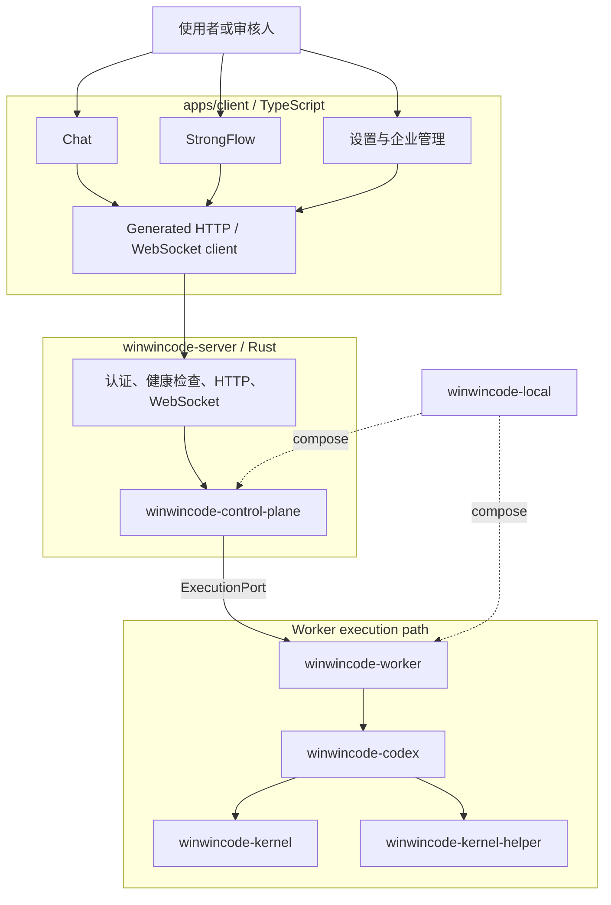
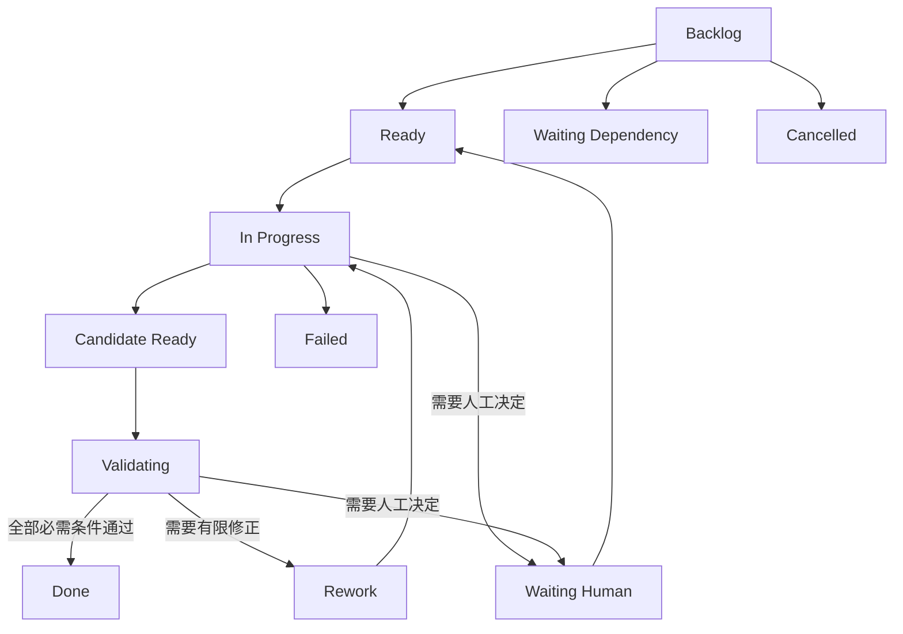

# 产品边界、单一路径架构、交付流程与安全模型

本文说明 WinWinCode 当前发布路径中事实的所有者、请求怎样穿过服务端和执行端、一个需求怎样成为可审核结果，以及本地和企业部署怎样复用同一份合同。

## 一句话架构

```text
apps/client (TypeScript)
          │ generated HTTP / WebSocket client
          ▼
winwincode-server (Rust)
          │
          ├─ winwincode-control-plane  ← 产品状态、策略、凭据引用
          │          │ ExecutionPort
          │          ▼
          └─ winwincode-worker         ← 工作区、Job、Lease、结果
                         │
                         ├─ winwincode-codex → winwincode-kernel
                         └─ winwincode-kernel-helper

winwincode-local 只负责在本机组装 Control Plane 和 Worker。
```

`apps/client` 是唯一 TypeScript 表现层，也是 TypeScript Presentation Layer。Rust Control Plane 由 `winwincode-control-plane` 实现，Rust Execution Worker 由 `winwincode-worker` 实现；Codex Core 是唯一执行内核。

目标边界由 [ADR-0028](decisions/0028-control-plane-worker-migration.md) 固定；机器可读的
[目标图](decisions/0028-control-plane-worker-target-graph.json) 和
[源码清单](decisions/0028-control-plane-worker-migration.inventory.json) 必须与当前目录同步。

## 目标所有权

| 层 | 负责的事实 | 不负责的事实 |
| --- | --- | --- |
| `apps/client` | 页面、组件、路由、表单、图表、浏览器状态和请求 | 业务判定、领域持久化、Worker 调度和执行 |
| `winwincode-server` | 一个认证后的 HTTP、WebSocket 和健康检查边界 | 另建业务状态或第二个执行协议 |
| `winwincode-control-plane` | ProductSession、Delivery、Approval、Attention、Provider、Credential 引用、Scheduler、Publication、Audit、策略与产品持久化 | Codex 内部 Plan、Agent、工具和代码执行 |
| `winwincode-worker` | WorkerSession、Job、Lease、Fencing、工作区、候选、产物、运行事件和结果 | 产品状态、组织权限和长期 Provider 密钥 |
| `winwincode-kernel` | CodexThread、Turn、Plan、Agent Graph、工具、Shell、沙箱、权限、Diff、用量和恢复 | 产品会话、交付状态、Worker 生命周期和发布决定 |
| `winwincode-kernel-helper` | 经过身份校验的辅助可执行文件和握手 | 产品状态、网络 API 和长期凭据 |
| `winwincode-local` | 读取进程配置、组装两个 Rust 模块、启动、停止和有限诊断 | 业务写入、Provider 路由、工作区和执行决策 |

所有业务写入都进入 Control Plane。Server 只负责边界和组合，Client 只通过
[`control-plane-client.ts`](../packages/control-plane-client/src/index.ts) 调用生成客户端；Worker
通过 `ExecutionPort` 上报事实，不能直接改写 Delivery 或 ProductSession。

## 目标运行结构



### HTTP、WebSocket 与 ExecutionPort

- HTTP Command 和 Query 携带 `requestId` 与 `expectedRevision`，Server 返回生成合同定义的结果或错误。
- WebSocket 只发送 Projection、运行事件、审批请求、Attention、任务和在线状态，不作为业务写入通道。
- Control Plane 与 Worker 通过版本化 [`ExecutionPort 合同`](contracts/execution-port-v1.md)交换注册、能力、心跳、Job、Lease、Fencing、运行事件、模型流、输入、审批、取消、结果和产物引用。
- Server 的 [`GeneratedContractDispatcher`](../crates/winwincode-server/src/dispatcher.rs) 是公开请求的唯一入口；运行时先验证租户范围、主体、请求相关性和当前版本。
- 同进程部署仍使用同一 typed frame；分进程部署只替换传输，不替换状态语义。

### Session 身份

四个身份保持独立，不能压成一个 `session_id`：

| 身份 | 所有者 | 作用 |
| --- | --- | --- |
| `ProductSession` | `winwincode-control-plane` | 用户看到的产品会话和消息入口 |
| `WorkerSession` | `winwincode-worker` | 一次可租约、取消和恢复的执行上下文 |
| `CodexThread` | `winwincode-kernel` | Codex 上下文、Turn 和执行历史 |
| `WorkRun` | Delivery | 一个 WorkItem 的一次受租约约束的执行尝试 |

`SessionBinding` 把四种身份与 Delivery、WorkItem、Job、Lease 和 Fencing 事实关联起来。
重启、重试、Worker 替换或重新验证时，每个身份按自己的生命周期推进；旧尝试的运行、结果和取消事实保持不变。

## 唯一的交付数据模型

WinWinCode 的可执行交付模型由 [ADR-0033](decisions/0033-community-engineering-runtime.md) 固定为七个对象：

| 对象 | 保存什么 |
| --- | --- |
| `WorkContract` | 目标、范围、约束、验收条件和需要人工授权的边界 |
| `WorkItem` | 可独立验收的工作单元、依赖、状态和合同 revision |
| `WorkRun` | WorkItem 的一次 Job、Lease、Fencing、Worker 与 CodexThread 执行身份 |
| `Candidate` | 当前 WorkRun 产出的不可变代码候选及其摘要 |
| `VerificationPlan` | 绑定合同、WorkItem、Candidate 和验证角色的检查计划 |
| `Evidence` | 绑定当前 WorkRun、Candidate 和持久化来源位置的证据 |
| `Verdict` | 对当前候选按验收条件计算出的最终结论 |

领域与 HTTP 类型从 [canonical schema](../schema/winwincode/v1/README.md) 生成；生成结果位于
[`apps/client/src/generated`](../apps/client/src/generated/contracts.ts)、
[`winwincode-api`](../crates/winwincode-api/src/generated.rs)、
[`winwincode-domain`](../crates/winwincode-domain/src/generated.rs) 和
[`openapi.generated.json`](../schema/winwincode/v1/openapi.generated.json)。

## Plan、WorkItem 和证据

Codex Plan 回答“当前一次执行要做哪些步骤”；`WorkItem` 回答“哪些工作可以独立验收、失败、返工和批准”。Plan 只由 Kernel 保存，WorkItem 和 Delivery 只由 Control Plane 保存；页面显示两者的投影，不建立第三份任务状态。

WorkItem 使用 `backlog`、`ready`、`in_progress`、`waiting_dependency`、`waiting_human`、`candidate_ready`、`validating`、`rework`、`done`、`failed` 和 `cancelled`。每次执行只创建一个绑定具体 WorkItem revision 的 `WorkRun`；一个未解决的 `AttentionItem` 会把相关工作置为 `waiting_human`。



最终结论由当前候选、冻结提交、运行结果和独立角色计算。`submitVerdict()` 不接受调用方直接制作的 Evidence 或 Verdict；Server 重新验证候选、事件身份、角色完整性和每项条件后才写入结论。Agent 的文本回复不是交付证据。最终结果使用 `winwincode.independent-verification-result.v1` 结构。

### 执行图状态

架构图和流程图贯穿三个公开状态：

| 状态 | 展示 | 内容边界 |
| --- | --- | --- |
| `before-execution` | 节点为绿色 | 只展示已审核的节点和关系 |
| `executing` | 变化节点为浅蓝色 | 展示影响范围，不返回候选文件和原始日志 |
| `execution-finished` | 变化节点为黄色 | 展示当前候选、Diff、运行活动和 Evidence 引用 |

结束状态从明确的 base commit、candidate commit 和摘要重新计算，不使用执行中缓存的文件内容。

## Provider、Credential 与外部副作用

Provider Gateway 是 Control Plane 内部的唯一模型路由和长期 Credential 使用者。Worker 只通过 `execution-port-model-stream` 请求模型并接收流；请求中只带短期引用、路由和预算事实。Credential 服务保存受保护引用，公开合同和持久 Delivery 不保存原始密钥。

Publication 先在 Control Plane 写入审批绑定、操作键和本地 receipt，再执行外部写入；重试通过同一操作键查询已存在的结果。Audit Ledger 保存主体、范围、操作、结果和摘要链，不复制命令正文、模型正文或凭据。

## 本地与企业部署

### 本地部署

```text
winwincode-local
├─ winwincode-control-plane
└─ winwincode-worker
   ├─ winwincode-codex
   ├─ winwincode-kernel
   └─ winwincode-kernel-helper
```

[`winwincode-local`](../crates/winwincode-local/src/lib.rs) 只负责生命周期和组合。它通过注入的 Control Plane 端点和 `LocalWorkerAdapter` 传递 typed frame，并为每个进程生成独立数据根；SQLite、租约、收据和 outbox 的语义与企业部署相同。

### 企业部署

```text
winwincode-server
└─ winwincode-control-plane
   ├─ winwincode-worker A
   ├─ winwincode-worker B
   └─ Worker pool
```

Server 可部署在独立网络边界，Worker 按平台、容量、仓库和策略分配。PostgreSQL、对象存储、集中密钥服务和审计导出只替换明确的 Rust port，不改变 Client 或 ExecutionPort 合同。

## 重启、取消与恢复

Server 启动先恢复持久 state、receipt、outbox、SessionBinding 和事件游标，再接受请求；待发送 outbox 重新发送同一个事件。Worker 重新取得合法 Lease 后只恢复自己的 Job 和工作区。Control Plane 通过 `requestId`、revision、attempt、Lease 和 Fencing 校验重复或过期写入。

取消是独立终态：Control Plane 先提交取消事实，Worker 仅对当前 attempt 执行取消，重复取消返回原始 receipt。重启不重放已经结算的工具或命令；新 retry 创建 attempt+1，并建立新的 WorkerSession、CodexThread 和 SessionBinding。旧 attempt 的 runtime、outcome 和 cancel 记录保持零写。

## 安全与人工责任

角色使用固定工作区和网络权限：

| 角色 | 工作区模式 | 责任 |
| --- | --- | --- |
| `requirements` | `source-read-only` | 整理目标、范围、条件和未决问题 |
| `solution` | `source-read-only` | 准备方案和结构化图 |
| `planner` | `source-read-only` | 使用 Kernel Plan 准备执行步骤 |
| `executor` | `candidate-write` | 在候选工作区实施获批方案 |
| `reviewer` | `candidate-read-only` | 独立评审冻结候选 |
| `verifier` | `candidate-read-only` | 逐项验证验收条件 |
| `adversarial-verifier` | `candidate-read-only` | 检查边界、失败和拒绝路径 |
| `remediator` | `candidate-write` | 只处理已批准的有限返工 |

人工决定绑定当前 ProductSession、WorkRun、Delivery revision、候选和审查集合摘要。过期页面、另一主体或另一角色的决定会在写入前被拒绝。公开响应只返回稳定错误码、请求 ID 和受限详情。

## 实现与检查索引

| 结论 | 实现 | 检查 |
| --- | --- | --- |
| Client 只有一个请求 facade | [`packages/control-plane-client/src/index.ts`](../packages/control-plane-client/src/index.ts) | [`tests/control-plane-client-facade.test.mjs`](../tests/control-plane-client-facade.test.mjs) |
| Client 通过一个 `serverUrl` 派生两种传输 | [`apps/client/src/runtime-config.ts`](../apps/client/src/runtime-config.ts) | [`tests/client-server-separation.test.mjs`](../tests/client-server-separation.test.mjs) |
| Server 是唯一公开网络边界 | [`crates/winwincode-server/src/server.rs`](../crates/winwincode-server/src/server.rs) | [`tests/server-durable-event-hub-contract.test.mjs`](../tests/server-durable-event-hub-contract.test.mjs) |
| Server 只接受生成合同 | [`crates/winwincode-server/src/dispatcher.rs`](../crates/winwincode-server/src/dispatcher.rs) | [`tests/control-plane-http-contract.test.mjs`](../tests/control-plane-http-contract.test.mjs) |
| Control Plane 持有产品状态 | [`crates/winwincode-control-plane/src/lib.rs`](../crates/winwincode-control-plane/src/lib.rs) | [`crates/winwincode-control-plane/tests/lifecycle.rs`](../crates/winwincode-control-plane/tests/lifecycle.rs) |
| WorkRun 规则集中于 Rust | [`crates/winwincode-delivery/src/application/workrun.rs`](../crates/winwincode-delivery/src/application/workrun.rs) | [`crates/winwincode-delivery/tests/workrun_replacement.rs`](../crates/winwincode-delivery/tests/workrun_replacement.rs) |
| Repository Context 只读且绑定提交 | [`crates/winwincode-repository-context/src/lib.rs`](../crates/winwincode-repository-context/src/lib.rs) | [`crates/winwincode-repository-context/tests/repository_context.rs`](../crates/winwincode-repository-context/tests/repository_context.rs) |
| Worker 持有 Job、Lease 和工作区 | [`crates/winwincode-worker/src/lib.rs`](../crates/winwincode-worker/src/lib.rs) | [`crates/winwincode-worker/tests/production_vertical.rs`](../crates/winwincode-worker/tests/production_vertical.rs) |
| Worker 通过 ExecutionPort 与 Control Plane 通信 | [`crates/winwincode-execution-port/src/lib.rs`](../crates/winwincode-execution-port/src/lib.rs) | [`tests/execution-port-contract.test.mjs`](../tests/execution-port-contract.test.mjs) |
| Codex 适配器连接唯一 Kernel | [`crates/winwincode-codex/src/adapter.rs`](../crates/winwincode-codex/src/adapter.rs) | [`tests/api-production-vertical.test.mjs`](../tests/api-production-vertical.test.mjs) |
| Kernel 保存 Plan、工具和权限事实 | [`crates/kernel/src/lib.rs`](../crates/kernel/src/lib.rs) | [`crates/winwincode-codex/src/adapter.rs`](../crates/winwincode-codex/src/adapter.rs) |
| Helper 身份在执行前校验 | [`crates/helper/src/main.rs`](../crates/helper/src/main.rs) | [`crates/winwincode-codex/src/helper_release.rs`](../crates/winwincode-codex/src/helper_release.rs) |
| Local 只组装两个 Rust 运行模块 | [`crates/winwincode-local/src/lib.rs`](../crates/winwincode-local/src/lib.rs) | [`tests/browser-local-controls-production.test.mjs`](../tests/browser-local-controls-production.test.mjs) |
| ProductSession 与绑定身份可恢复 | [`crates/winwincode-session/src/lib.rs`](../crates/winwincode-session/src/lib.rs) | [`crates/winwincode-control-plane/tests/session_identity_vertical.rs`](../crates/winwincode-control-plane/tests/session_identity_vertical.rs) |
| Provider Gateway 集中模型和凭据引用 | [`crates/winwincode-control-plane/src/provider_gateway.rs`](../crates/winwincode-control-plane/src/provider_gateway.rs) | [`crates/winwincode-control-plane/tests/provider_production.rs`](../crates/winwincode-control-plane/tests/provider_production.rs) |
| Publication 以 receipt 保护外部写入 | [`crates/winwincode-publication/src/coordinator.rs`](../crates/winwincode-publication/src/coordinator.rs) | [`crates/winwincode-publication/tests/publication_coordinator.rs`](../crates/winwincode-publication/tests/publication_coordinator.rs) |
| Audit 保存摘要链和 retention | [`crates/winwincode-audit/src/lib.rs`](../crates/winwincode-audit/src/lib.rs) | [`crates/winwincode-audit/tests/audit_store.rs`](../crates/winwincode-audit/tests/audit_store.rs) |
| Storage 原子写入 state、receipt 和 outbox | [`crates/winwincode-storage/src/lib.rs`](../crates/winwincode-storage/src/lib.rs) | [`crates/winwincode-storage/tests/execution_registry.rs`](../crates/winwincode-storage/tests/execution_registry.rs) |
| 独立角色生成逐项证据和 Verdict | [`scripts/run-api-production-vertical.mjs`](../scripts/run-api-production-vertical.mjs) | [`tests/api-production-vertical.test.mjs`](../tests/api-production-vertical.test.mjs) |

更多合同见 [`control-plane-web-client.md`](contracts/control-plane-web-client.md)、
[`control-plane-storage-lifecycle.md`](contracts/control-plane-storage-lifecycle.md)、
[`delivery-evidence-verdict-rework.md`](contracts/delivery-evidence-verdict-rework.md)、
[`browser-chat-production.rules.json`](contracts/browser-chat-production.rules.json)、
[`control-plane-api-coverage.matrix.json`](contracts/control-plane-api-coverage.matrix.json) 和
[`ADR-0023`](decisions/0023-canonical-delivery-ownership.md)。
