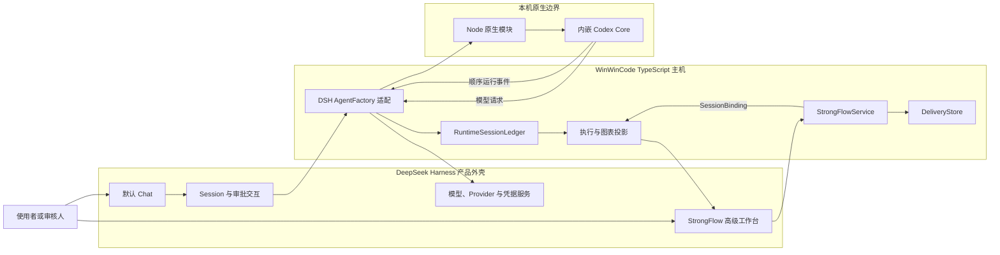
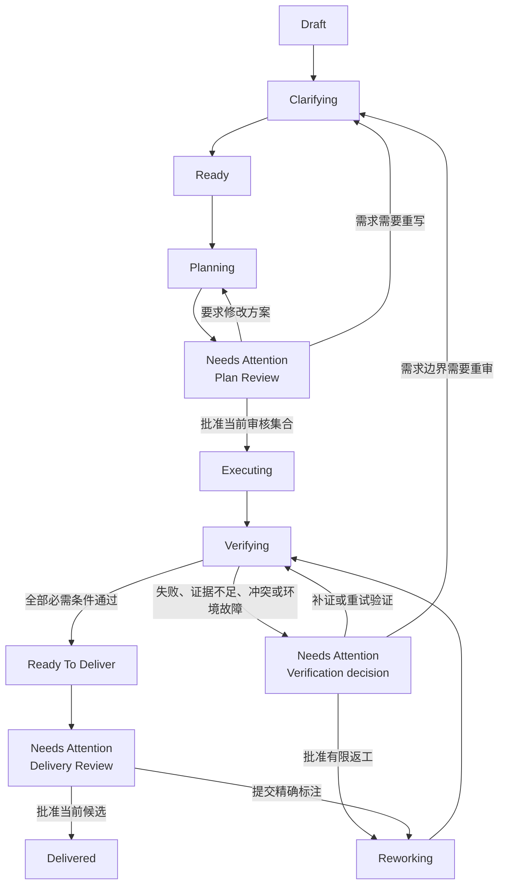

# 产品边界、交付流程与安全模型

本文面向使用者、贡献者和集成方，说明 WinWinCode 中每类事实由谁负责、一个需求怎样成为可审核的交付结果，以及当前本机版采用哪些安全边界。

## 一句话架构

```text
DSH 负责交互、模型、Session、凭据和执行审批界面
Codex Core 负责 Plan、Agent、工具、Shell、MCP、沙箱和代码执行
WinWinCode 负责交付目标、跨 Session 阶段、业务 Attention、Evidence 和 Verdict
```

一个事实只有一个写入方。其他层可以保存身份引用或生成只读视图，不能建立另一份可以独立修改的副本。

## 三层所有权

| 层 | 负责的事实 | 在本仓库中的接入点 |
| --- | --- | --- |
| Codex Core | Thread、Turn、Plan、Agent Graph、工具调用、Shell、MCP、沙箱、文件和网络权限、执行审批、Diff、用量、上下文与执行恢复 | [`crates/kernel/src/lib.rs`](../crates/kernel/src/lib.rs)、[`packages/native/src/index.ts`](../packages/native/src/index.ts) |
| DSH | Chat、Session 日志、会话恢复、模型与 Provider 选择、凭据服务、执行审批交互、Web/Cordis 外壳和界面扩展槽位 | [`apps/host/src/web-host.ts`](../apps/host/src/web-host.ts)、[`packages/dsh-profile/src/agent-factory.ts`](../packages/dsh-profile/src/agent-factory.ts)、[`packages/dsh-profile/src/model-port.ts`](../packages/dsh-profile/src/model-port.ts) |
| WinWinCode | `DeliverySpec`、验收条件、`DeliveryTask`、跨 Session 阶段、业务 `AttentionItem`、`EvidenceRef`、逐项结果和最终 `DeliveryVerdict` | [`packages/contracts/src/delivery.ts`](../packages/contracts/src/delivery.ts)、[`packages/strongflow/src/delivery-service.ts`](../packages/strongflow/src/delivery-service.ts) |
| GitHub 等外部系统 | Issue、Pull Request、评论、项目看板和团队讨论 | [`packages/contracts/src/strongflow-github-publication.ts`](../packages/contracts/src/strongflow-github-publication.ts)、[`packages/strongflow/src/github-publication-runner.ts`](../packages/strongflow/src/github-publication-runner.ts) |

因此，StrongFlow 看板是 Delivery 与 Codex 事件的视图。它不会调度 Agent，也不会把 Codex Plan 复制成另一套任务系统。模型提供商和凭据仍通过 DSH 配置；Delivery 只保存所选 Session、阶段和证据的引用。

## 运行结构



### Rust 与 TypeScript 的边界

1. DSH Session 由 [`WinWinCodeAgentFactory`](../packages/dsh-profile/src/agent-factory.ts) 接到原生模块。
2. [`@winwincode/native`](../packages/native/src/index.ts) 只负责 Node 与 Rust 的类型转换、平台包选择和内核生命周期。
3. [`crates/kernel`](../crates/kernel/src/lib.rs) 直接创建 Codex Thread，应用角色权限，并调用 Codex 的提交、转向、中断、分叉、恢复和审批接口。
4. Codex 发起模型请求时，[`DshModelPort`](../packages/dsh-profile/src/model-port.ts) 把请求转换为 DSH `ctx.llm` 调用。提供商路由、模型选择和凭据仍由 DSH 解析。
5. Codex 事件按顺序返回 TypeScript，写入 [`RuntimeSessionLedger`](../packages/dsh-profile/src/session-ledger.ts)，再投影到 DSH Session 和 StrongFlow 工作台。

这条路径保留 Codex 的 `update_plan`、多 Agent、工具和沙箱能力。TypeScript 主机只连接产品外壳、执行内核和交付协议。

## 两个产品入口

发布包的 `winwincode` 命令按固定顺序加载 DSH base、DSH Web 和 WinWinCode profile。启动后：

- **Chat 是默认入口**：普通对话、模型选择、Session、执行审批和原始运行展示沿用 DSH。
- **StrongFlow 是高级入口**：用户主动切换后，查看或创建 Delivery，审核需求、方案、图、验收依据和结论。
- 返回 Chat 时，浏览器只按当前 DSH Session 记住所选 Delivery ID；Delivery 内容仍从 Host 读取。

入口和安装包检查见 [`apps/host/src/web-host.ts`](../apps/host/src/web-host.ts) 与 [`scripts/verify-installed-host.mjs`](../scripts/verify-installed-host.mjs)。

## 唯一的交付数据模型

WinWinCode 第一版只有十个业务对象。

| 对象 | 保存什么 |
| --- | --- |
| `Delivery` | 一次交付的根对象、当前 revision 和高层状态 |
| `DeliverySpec` | 标题、目标、范围、排除项、约束、仓库、基线和返工上限 |
| `AcceptanceCriterion` | 一项可单独判断的完成条件、验证方法和是否必需 |
| `DeliveryTask` | 具有独立交付意义的工作单元、依赖、责任人和关联验收条件 |
| `StageRun` | 一次阶段尝试、执行者类型、角色、状态和次数 |
| `SessionBinding` | 一个阶段与 DSH Session、Codex Session 的身份关系 |
| `AttentionItem` | 需要人处理的需求问题、业务决定、验证阻塞、范围变化或交付批准 |
| `EvidenceRef` | 指向测试、命令、Diff、文件、提交、PR、运行事件或评审发现的来源引用 |
| `CriterionResult` | 一个验收条件对当前候选的 `pass`、`fail`、`inconclusive` 或 `infra_error` 结果 |
| `DeliveryVerdict` | 当前候选的逐项结果、未解决发现和最终结论 |

以下内容是其他系统拥有的事实，或可以从已有事实重建的结果：

- Codex Thread、Turn、Plan Item、Subagent、Tool Call、Shell Process 和 Sandbox；
- DSH Chat Message、Session Event、Provider 和 Credential；
- 冻结候选、方案审核集合、执行图、GitHub Review Package、评估报告和发布报告。

派生结果可以写成可审核文件或运行日志，但不会进入 Delivery 的十个对象。

## Codex Plan 与 DeliveryTask

两级计划解决不同问题：

| 类型 | 回答的问题 | 状态所有者 |
| --- | --- | --- |
| Codex Plan | 当前 Session 为完成一次执行准备做哪些步骤 | Codex Core |
| `DeliveryTask` | 哪些工作可以独立验收、失败、返工、负责、依赖、产出或批准 | WinWinCode |

StrongFlow 展示 Codex Plan 的当前内容和变化，但不会据此自动建立 `DeliveryTask`。只有具备至少一项独立交付意义的工作才进入 Delivery；一个简单交付可以完全没有 `DeliveryTask`。

Session 内的并行工作继续使用 Codex Agent Graph。StrongFlow 只显示 Agent 节点、父子关系、角色和活动状态，不维护 roster、mailbox 或另一张 Agent 图。

### Codex 事件怎样成为 StrongFlow 视图

[`CodexRuntimeProjector`](../packages/dsh-profile/src/runtime-events.ts) 把内核事件规范化成带来源身份的 `RuntimeEvent`。其中：

- `plan_update`、`plan_delta` 和 Plan Item 生命周期形成结构化 `plan.updated`，不会降成普通聊天文本；
- 子 Agent 的创建、更新、等待、中断和结束形成 Agent Graph 变化；
- `request_user_input` 形成 `input.requested`，保留问题、选项和阻塞状态，供交付层判断是否需要业务 Attention；
- 命令和补丁审批形成 `approval.requested`，仍回到 DSH 执行审批交互；
- Diff、命令、测试、失败、恢复和用量保留原始事件引用，供视图、证据和评估重建。

[`DeliveryRuntimeProjection`](../packages/strongflow/src/delivery-runtime-projection.ts) 只读取与当前 `SessionBinding` 完全一致的事件。它按 StageRun 和 DeliveryTask 汇总当前 Plan、Agent Graph、变更文件、验证活动、审批、失败和用量，不写回 Codex 或 Delivery。

## Delivery 流程

`Delivery.status` 表示跨 Session 的业务状态，`StageRun` 表示一次由 Codex 或人完成的阶段尝试。人工审核期间，保存的 Delivery 状态是 `needs-attention`，对应的 `plan-review` 或 `delivery-review` StageRun 为 `waiting`。

服务使用七种阶段标识：`clarifying`、`planning`、`plan-review`、`executing`、`verifying`、`reworking` 和 `delivery-review`。



### 阶段怎样绑定 Session

- Codex 阶段使用同时含 `dshSessionId` 与 `codexSessionId` 的 `SessionBinding`。
- 人工阶段只绑定 `dshSessionId`，因为审核不会创建另一个 Codex Thread。
- `clarifying`、`planning`、`plan-review` 和 `delivery-review` 属于整个 Delivery。
- `executing`、`verifying` 和 `reworking` 可以绑定一个 `DeliveryTask`。
- 同一 Delivery 同时最多有一个活动 `StageRun`；阻塞中的业务 Attention 会阻止新阶段开始。

服务只提供七个操作：六个写入操作 `createDelivery()`、`updateDeliverySpec()`、`startStage()`、`bindSession()`、`resolveAttention()`、`submitVerdict()`，以及只读的 `getDeliveryProjection()`。每次变更都带 `requestId` 和预期 Delivery revision；相同请求可以重试，过期 revision 会在写入前失败。

## 需求、方案和人工审核

需求与方案是两个独立内容区：

- `DeliverySpec` 保存要交付的目标、范围、约束和验收条件；
- 方案审核集合保存实施摘要、步骤、组件、风险、未决事项、系统架构图和流程图；
- 方案集合写在现有 `AttentionItem.context` 中，并绑定当前 Spec revision、规划 StageRun、审核 StageRun、Session 和内容摘要。

默认系统架构图固定包含 DSH、StrongFlow、Codex Core 和 Repository 四个产品节点，再加入方案中声明的组件、外部系统和数据存储。默认流程图固定展示 DeliverySpec、方案、方案审核、需求澄清、方案修改、执行、验证、Attention、返工、交付审核和已交付节点。两张图都使用结构化节点和关系生成，也提供文字清单；审核协议不接收任意图形标记。

方案批准只对这一份精确集合有效。Spec revision、审核 Session、方案、图或摘要发生变化后，旧决定不能进入执行。要求修改会回到 Planning；需求本身需要调整时回到 Clarifying。

最终交付批准同样绑定当前 Spec、冻结候选、Diff、通过的 Verdict，以及配置了 GitHub 来源时的 Issue 和 Pull Request 目标。审核人退回候选时，必须把意见绑定到当前黄色图节点、文件和 Diff hunk；后续修改由新的 `remediator` Codex Session 完成，并重新进入独立验证。

对应实现见 [`packages/strongflow/src/plan-review.ts`](../packages/strongflow/src/plan-review.ts)、[`packages/strongflow/src/delivery-service.ts`](../packages/strongflow/src/delivery-service.ts) 和 [`packages/strongflow/src/github-publication.ts`](../packages/strongflow/src/github-publication.ts)。

## 执行图的三种状态

系统架构图和流程图使用同一批稳定节点贯穿一次交付：

| 状态 | 节点表现 | 可查看内容 |
| --- | --- | --- |
| `before-execution` | 所有节点为绿色正常状态 | 已审核的节点和关系 |
| `executing` | 有变化的节点为浅蓝色 | 实时影响范围；不返回文件路径、命令、hunk 或 Evidence 详情 |
| `execution-finished` | 有变化的节点为黄色 | 当前候选的文件、hunk、命令、测试、Agent 活动和 Evidence 引用 |

结束状态不是执行中缓存的改名。Host 会从当前冻结候选和 SHA-256 完全一致的权威 Diff 重新生成详情。文件只按已审核方案中的仓库相对路径映射到架构节点，流程节点按执行阶段映射。候选、Diff 或审核集合不一致时，详情生成失败。

结构和检查见 [`packages/contracts/src/strongflow-diagram-execution.ts`](../packages/contracts/src/strongflow-diagram-execution.ts)、[`packages/strongflow/src/diagram-execution-projection.ts`](../packages/strongflow/src/diagram-execution-projection.ts) 与 [`tests/diagram-execution-projection.test.mjs`](../tests/diagram-execution-projection.test.mjs)。

## 验收、证据和结论

验证阶段使用独立 Codex Session。`reviewer` 和 `verifier` 都是必需角色，`adversarial-verifier` 可以按交付要求加入；这些角色使用候选只读工作区。

最终回复必须符合 `winwincode.independent-verification-result.v1` 的严格 JSON 结构。WinWinCode 随后重新完成以下检查：

1. 验证 Session、StageRun、SessionBinding、Spec revision 和候选身份一致；
2. 每个 finding 引用的是更早出现且类型匹配的 Codex 事件；
3. Diff、文件、提交和评审发现属于当前冻结候选；
4. 每个当前验收条件都有唯一结果；
5. 必需角色齐全，没有候选写入、结论冲突或开放的阻塞 Attention；
6. 全部必需条件为 `pass` 后，Delivery 才能进入 `ready-to-deliver`。

`submitVerdict()` 不接收调用方制作的 `EvidenceRef`、`CriterionResult` 或 `DeliveryVerdict`。它只接收冻结候选、规范化 Codex 事件和必需验证角色，再由服务计算这些结果。Agent 的“已经完成”消息本身不构成交付证据。

## Attention 与人的责任

Codex 的命令或补丁审批，和 WinWinCode 的业务 Attention 是两条独立路径：

- **执行审批**回答“这次命令、文件修改或权限请求是否允许”，由 Codex 触发、DSH 展示并把决定送回同一个 Codex 操作。
- **业务 Attention**回答“需求、方案、范围、验证或交付是否可以进入下一阶段”，由 StrongFlow 状态机处理。

当前本机版使用最小责任闭环，不建立组织权限系统：

| 人的责任 | 可做的决定 | 保存位置 |
| --- | --- | --- |
| Requester | 提出目标并回答需求问题 | DSH 对话或外部 Issue；确认后的内容进入 `DeliverySpec` |
| Task Owner | 负责一个可独立交付的工作单元 | `DeliveryTask.owner` |
| Plan Reviewer | 批准方案、要求修改或退回需求澄清 | 绑定人工 StageRun 的 `AttentionItem` |
| Delivery Approver | 批准当前候选，或对黄色节点和 hunk 提交返工标注 | `delivery_approval` Attention 的结构化决定 |
| Observer | 查看 Delivery 投影和绑定 Session | DSH 与 StrongFlow 只读视图 |

Attention 还保存当前 `assignedTo`、最终 `resolvedBy` 和决定对阶段的影响。长讨论、Mention、团队排期和外部项目看板继续由 GitHub、Jira、Linear、Slack 或 Teams 管理。

## 重启和恢复

重启时使用两组持久事实：

- [`DeliveryStore`](../packages/strongflow/src/delivery-store.ts) 保存按摘要连接的追加记录和每次变更后的完整 Delivery 快照；
- [`RuntimeSessionLedger`](../packages/dsh-profile/src/session-ledger.ts) 保存 DSH/Codex Session 映射、Codex rollout 路径和顺序运行事件。

[`reconcileDeliveryAfterRestart()`](../packages/dsh-profile/src/delivery-recovery.ts) 重新读取这两组记录，重建 DSH 与 StrongFlow 视图，并只通过 Codex 的 `listSessions()` 查询当前 Thread 是否已加载。它返回唯一下一步，例如处理 Attention、恢复阶段 Session、继续活动阶段、审核终态输出或开始状态机明确要求的新阶段。

恢复过程不会重放 Tool 或命令。一个 Agent 最终回复即使声称完成，也只会进入“审核阶段输出”；`StageRun`、Evidence 和 Verdict 必须由各自的写入操作推进。Session 身份、角色、候选或记录摘要冲突时，恢复会停止并报告冲突。

## 安全模型

### 当前部署边界

当前版本面向一个 macOS 或 Linux 用户在自己的操作系统账户中运行 DSH Web、StrongFlow Host 和内嵌 Codex。工作区、`DSH_HOME`、本地 Session 以及其中可访问的凭据都处在该用户的主机权限范围内。

Organization、共享数据库、RBAC、SSO、多租户隔离和跨机器调度属于多人服务器产品阶段。当前本机证明不应被解释成这些能力已经存在。

### 执行权限

八个 StrongFlow 角色使用固定工作区权限：

| 角色 | 工作区模式 | 责任 |
| --- | --- | --- |
| `requirements` | `source-read-only` | 整理需求、范围、条件和未决问题 |
| `solution` | `source-read-only` | 为已确定需求准备方案和语义图 |
| `planner` | `source-read-only` | 使用 Codex Plan 和多 Agent 能力准备执行计划 |
| `executor` | `candidate-write` | 在候选工作区实施已审核方案 |
| `reviewer` | `candidate-read-only` | 独立评审当前冻结候选 |
| `verifier` | `candidate-read-only` | 逐项验证验收条件 |
| `adversarial-verifier` | `candidate-read-only` | 检查负面路径、边界和失败处理 |
| `remediator` | `candidate-write` | 只处理已审核的有限返工 |

Rust 内核再次核对角色与工作区模式，并把权限转换成 Codex 的只读或工作区写入配置；文件根限制在规范化后的当前工作区，网络为 restricted，审批策略为 on-request，审批人是用户。角色配置不能删除 Codex 的 Shell、Plan 或多 Agent 工具。

### 人工决定

浏览器提交的是“使用当前 DSH Session”的固定引用。Host 先检查该 Session 是否正好绑定当前人工 StageRun，再在进程内替换成随机本机证明。证明不会发送到浏览器、写入 Delivery 或出现在响应中。CLI 使用单独的本机 peer proof。

所有人工决定还绑定预期 Delivery revision。方案审核、交付审核和 GitHub 发布审核会继续核对各自的完整集合摘要，因此旧页面、旧候选或另一 Session 的决定不能推进状态。

### 凭据

模型和 GitHub 提供商的认证由 DSH 或提供商插件持有。WinWinCode 的持久 Delivery 只保存 Provider、Session 或外部资源引用。六项变更操作在写入前检查原始密钥、Bearer、JWT、私钥、常见 Provider token 和带认证信息的 URL；响应也不能回显人工证明。

这项检查是持久化边界，不代替 DSH 凭据存储或操作系统账户保护。实现与回归检查见 [`packages/strongflow/src/credential-boundary.ts`](../packages/strongflow/src/credential-boundary.ts)、[`packages/contracts/src/strongflow-delivery-api.ts`](../packages/contracts/src/strongflow-delivery-api.ts) 和 [`tests/delivery-credential-boundary.test.mjs`](../tests/delivery-credential-boundary.test.mjs)。

### 数据完整性和外部副作用

- Delivery 记录使用连续 sequence、前一记录摘要、当前记录摘要、`requestId` 和请求摘要；损坏或身份冲突会失败。
- Runtime Event 保存 Codex Core 来源、DSH/Codex Session、事件流、顺序号、Turn、Item、Tool、Approval 和 Agent 身份。
- 冻结候选绑定 base/candidate commit、tree、Diff SHA-256、变更路径、生产 StageRun 和 SessionBinding。
- GitHub 发布默认 dry-run。显式 live 发布先写本地追加 journal，再按稳定 operation key 查询和对账远端 branch、PR、Issue comment 与 commit status。
- 发布报告要求四个 macOS/Linux 原生目标、当前源码身份、当前真实 Delivery 结果、Apache-2.0 和第三方通知全部一致；报告本身不会执行发布。

## 代码与检查索引

下表给出本文主要结论的直接实现和可执行检查。

| 结论 | 直接实现 | 可执行检查 |
| --- | --- | --- |
| Codex 是唯一执行内核 | [`crates/kernel/src/lib.rs`](../crates/kernel/src/lib.rs) | [`tests/native-lifecycle.test.mjs`](../tests/native-lifecycle.test.mjs)、[`tests/native-dsh-model-turn.test.mjs`](../tests/native-dsh-model-turn.test.mjs) |
| DSH 提供默认 Chat、Session、模型和审批交互 | [`apps/host/src/web-host.ts`](../apps/host/src/web-host.ts)、[`packages/dsh-profile/src/agent-factory.ts`](../packages/dsh-profile/src/agent-factory.ts) | [`tests/keyless-dsh-product-smoke.test.mjs`](../tests/keyless-dsh-product-smoke.test.mjs)、[`scripts/verify-installed-host.mjs`](../scripts/verify-installed-host.mjs) |
| DSH 模型路由进入内嵌 Codex | [`packages/dsh-profile/src/model-port.ts`](../packages/dsh-profile/src/model-port.ts) | [`tests/dsh-model-port.test.mjs`](../tests/dsh-model-port.test.mjs)、[`tests/native-dsh-model-turn.test.mjs`](../tests/native-dsh-model-turn.test.mjs) |
| Delivery 只有十个业务对象 | [`packages/contracts/src/delivery.ts`](../packages/contracts/src/delivery.ts) | [`tests/delivery-contract.test.mjs`](../tests/delivery-contract.test.mjs) |
| 七项 Host 操作共用一个状态入口 | [`packages/contracts/src/strongflow-delivery-api.ts`](../packages/contracts/src/strongflow-delivery-api.ts)、[`packages/strongflow/src/delivery-invoker.ts`](../packages/strongflow/src/delivery-invoker.ts) | [`tests/strongflow-delivery-api.test.mjs`](../tests/strongflow-delivery-api.test.mjs)、[`tests/strongflow-delivery-adapters.test.mjs`](../tests/strongflow-delivery-adapters.test.mjs) |
| 需求和方案分开且必须人工审核 | [`packages/strongflow/src/plan-review.ts`](../packages/strongflow/src/plan-review.ts) | [`tests/plan-review.test.mjs`](../tests/plan-review.test.mjs)、[`tests/strongflow-workbench.test.mjs`](../tests/strongflow-workbench.test.mjs) |
| Codex Plan 和 Agent Graph 只做投影 | [`packages/dsh-profile/src/runtime-events.ts`](../packages/dsh-profile/src/runtime-events.ts)、[`packages/strongflow/src/delivery-runtime-projection.ts`](../packages/strongflow/src/delivery-runtime-projection.ts) | [`tests/delivery-runtime-projection.test.mjs`](../tests/delivery-runtime-projection.test.mjs) |
| 执行图具有前、中、后三种状态 | [`packages/strongflow/src/diagram-execution-projection.ts`](../packages/strongflow/src/diagram-execution-projection.ts) | [`tests/diagram-execution-projection.test.mjs`](../tests/diagram-execution-projection.test.mjs) |
| Evidence 和 Verdict 由当前运行事实计算 | [`packages/strongflow/src/delivery-verdict.ts`](../packages/strongflow/src/delivery-verdict.ts)、[`packages/strongflow/src/candidate-evidence.ts`](../packages/strongflow/src/candidate-evidence.ts) | [`tests/delivery-verdict.test.mjs`](../tests/delivery-verdict.test.mjs)、[`tests/candidate-evidence.test.mjs`](../tests/candidate-evidence.test.mjs) |
| Reviewer 与 Verifier 使用独立只读 Session | [`packages/strongflow/src/independent-verification.ts`](../packages/strongflow/src/independent-verification.ts) | [`tests/independent-verification.test.mjs`](../tests/independent-verification.test.mjs) |
| 角色工作区、网络和审批由 Codex 权限执行 | [`packages/contracts/src/strongflow-role.ts`](../packages/contracts/src/strongflow-role.ts)、[`crates/kernel/src/lib.rs`](../crates/kernel/src/lib.rs) | [`tests/native-role-session.test.mjs`](../tests/native-role-session.test.mjs)、[`scripts/verify-native-install.mjs`](../scripts/verify-native-install.mjs) |
| 人工 Session 证明和凭据不会进入 Delivery | [`packages/strongflow/src/delivery-remote.ts`](../packages/strongflow/src/delivery-remote.ts)、[`packages/strongflow/src/credential-boundary.ts`](../packages/strongflow/src/credential-boundary.ts) | [`tests/delivery-service.test.mjs`](../tests/delivery-service.test.mjs)、[`tests/delivery-credential-boundary.test.mjs`](../tests/delivery-credential-boundary.test.mjs) |
| 重启只重建视图并选择一个下一步 | [`packages/dsh-profile/src/delivery-recovery.ts`](../packages/dsh-profile/src/delivery-recovery.ts) | [`tests/delivery-recovery.test.mjs`](../tests/delivery-recovery.test.mjs)、[`tests/delivery-restart-idempotency.test.mjs`](../tests/delivery-restart-idempotency.test.mjs) |
| GitHub 写入可审核、可重试和可对账 | [`packages/strongflow/src/github-publication-runner.ts`](../packages/strongflow/src/github-publication-runner.ts) | [`tests/github-publication.test.mjs`](../tests/github-publication.test.mjs)、[`tests/github-review-package.test.mjs`](../tests/github-review-package.test.mjs) |
| 发布要求当前源码、四个平台产物和当前交付证据 | [`scripts/product-release-gate.mjs`](../scripts/product-release-gate.mjs) | [`tests/product-release-gate.test.mjs`](../tests/product-release-gate.test.mjs) |

完整设计决定见 [ADR-0023](decisions/0023-canonical-delivery-ownership.md)。上游 Codex 与 DSH 的固定版本和补丁边界见 [ADR-0001](decisions/0001-upstream-integration.md)。
