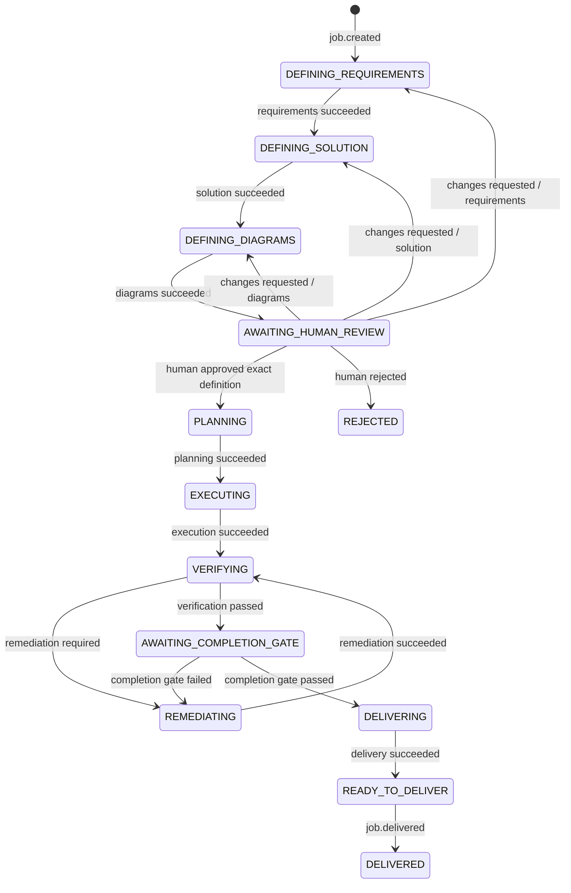

# ADR-0002：用独立事件语言约束 StrongFlow 作业

- 状态：已接受
- 日期：2026-08-21
- 对应任务：`winwincode-9c4.2.1`
- 合同实现：[`packages/contracts/src/strongflow-job.ts`](../../packages/contracts/src/strongflow-job.ts)

## 结论

StrongFlow 使用一套版本化、只追加、可完整重放的作业事件描述业务进度。这套事件只表达需求、方案、图、人工审核、规划、执行、验证、修复和交付，不复制 Codex 内核运行事件，也不保存 DSH 界面展示状态。

三类记录通过不可变标识关联，但各自独立：

```text
StrongFlow 作业事件 ── KernelSessionId ── Codex 内核运行记录
        │
        └──────── JobId / artifact ids ── DSH 界面投影
```

这样，重启后只需重放作业事件就能回答“当前定义是什么、是否已由人批准、能否执行、候选结果是否通过交付门禁”。内核日志丢失或界面重建不会改变这些业务结论。

## 标识和版本

事件版本与投影版本当前都为 `1`。每个标识都是经过运行时校验的非空字符串，并在 TypeScript 中使用不同品牌类型，防止把一种标识误传成另一种：

| 标识 | 唯一含义 |
| --- | --- |
| `JobId` | 一项 StrongFlow 作业 |
| `AttemptId` | 一次阶段尝试 |
| `StageRunId` | 一次阶段运行 |
| `CandidateId` | 一份已执行、待验证或待交付的候选结果 |
| `RequirementId` | 一版不可变需求 |
| `SolutionId` | 一版不可变方案 |
| `DiagramId` | 一张不可变图 |
| `HumanReviewId` | 一次人工决定 |
| `KernelSessionId` | 与阶段运行关联的 Codex 会话 |

事件序号使用规范十进制字符串而不是 JSON 数字，投影要求从 `1` 开始严格连续。这样不会因 JavaScript 安全整数上限而丢失长时间运行作业的序号。

## 定义和人工批准

可批准的定义是一个不可拆分的四元组：

```text
RequirementId
+ SolutionId
+ systemArchitectureDiagramId
+ processFlowDiagramId
```

人工决定必须同时记录审核人、时间、决定、提交通道、完整四元组和可选意见。通道只能是已认证本地界面 `local-ui` 或显式命令行操作 `cli`。只有 `human` 来源且来源身份等于记录中的审核人时，决定才有效。角色或工具不能批准自己的输出。

`approved` 只解锁它明确引用的四元组。需求、方案、系统架构图或流程流转图中任一标识变化后，旧批准不再匹配。`changes-requested` 还会立即删除当前批准、候选结果和交付门禁，并按修改范围回到对应定义阶段：

| 修改范围 | 保留内容 | 返回状态 |
| --- | --- | --- |
| `requirements` | 无 | `DEFINING_REQUIREMENTS` |
| `solution` | 当前需求 | `DEFINING_SOLUTION` |
| `diagrams` | 当前需求和方案 | `DEFINING_DIAGRAMS` |

`rejected` 是终止决定；需要继续修改时使用 `changes-requested`，两者不混用。

## 状态的唯一含义

| 状态 | 唯一含义 | 下一项正常工作 |
| --- | --- | --- |
| `DEFINING_REQUIREMENTS` | 尚未得到当前版本需求 | 运行需求阶段 |
| `DEFINING_SOLUTION` | 已有需求，尚未得到匹配方案 | 运行方案阶段 |
| `DEFINING_DIAGRAMS` | 已有需求和方案，尚未得到两张匹配图 | 运行图生成阶段 |
| `AWAITING_HUMAN_REVIEW` | 定义完整，但尚无当前人工决定 | 等待人工批准、退回或拒绝 |
| `PLANNING` | 当前定义已批准，尚未完成执行计划 | 运行规划阶段 |
| `EXECUTING` | 计划已完成，尚未产生候选结果 | 运行执行阶段 |
| `VERIFYING` | 已有候选结果，正在等待验证结论 | 运行验证阶段 |
| `REMEDIATING` | 验证或完成门禁要求修复当前候选结果 | 运行修复阶段 |
| `AWAITING_COMPLETION_GATE` | 验证已通过，尚未取得完成门禁结果 | 运行程序化完成门禁 |
| `DELIVERING` | 完成门禁已通过，尚未完成交付阶段 | 运行交付阶段 |
| `READY_TO_DELIVER` | 交付阶段已完成，等待记录最终交付 | 写入最终交付事件 |
| `INTERRUPTED` | 非终态工作被暂停，原状态已保存 | 显式恢复或取消 |
| `FAILED` | 阶段因任务错误或基础设施错误终止 | 无 |
| `REJECTED` | 人工明确拒绝当前定义 | 无 |
| `CANCELLED` | 人或系统明确取消作业 | 无 |
| `DELIVERED` | 已通过完成门禁且已完成交付 | 无 |

状态名表达“现在欠哪一步”，已完成里程碑则保存在定义、批准、候选结果和门禁记录中。例如，`EXECUTING` 同时意味着规划已完成；不再增加一个含义相同、停留时间为零的 `PLANNED` 状态。

## 正常流转和修改环



在批准后的任一非活动阶段，人工仍可针对当前四元组请求修改。流转会使用同一套范围规则退回定义阶段并撤销批准。规划、执行、验证、修复和交付阶段每次开始与结束必须使用完全相同的 `StageRunId`、`AttemptId`、阶段和角色身份。

## 强制门禁

以下规则由纯状态转换函数执行，不依赖提示词或界面按钮：

1. 未得到匹配当前四元组的人工批准时，规划以及后续执行阶段不能开始或完成。
2. 人工决定只能由同名的 `human` 来源提交。
3. 模型角色不能提交取消、恢复、完成门禁或最终交付控制事件。
4. 验证、修复、完成门禁和交付必须引用当前 `CandidateId`。
5. `job.delivered` 只允许从 `READY_TO_DELIVER` 进入 `DELIVERED`，且投影中必须保留同一候选结果的 `completion-gate.passed` 记录。
6. `FAILED`、`REJECTED`、`CANCELLED` 和 `DELIVERED` 都是终态，之后的事件在产生副作用前被拒绝。

## 停止原因不是同一个状态

| 结果 | 记录 | 是否终态 | 含义 |
| --- | --- | --- | --- |
| 人工拒绝 | `human-rejection` | 是 | 人明确不接受定义 |
| 取消 | `cancellation` | 是 | 人或系统主动终止作业 |
| 中断 | `interruption` | 否 | 进程退出、维护或显式暂停；可回到保存的原状态 |
| 任务失败 | `task-failure` | 是 | 阶段工作本身失败 |
| 基础设施失败 | `infrastructure-failure` | 是 | 环境、进程、存储或外部服务失败 |

中断时活动阶段会被清除；恢复只回到中断前状态，不假装原阶段仍在运行。控制器必须创建新的 `StageRunId` 和 `AttemptId` 再次开始该阶段。

## 无损 JSON 和重放规则

事件在创建、接收和重放时使用同一套验证：

- 只接受 `null`、布尔值、有限普通数字、字符串、连续数组和普通对象；
- 拒绝 `undefined`、`NaN`、无穷大、负零、稀疏数组、额外数组属性、循环引用、符号键、`Date` 或其他带自定义原型的对象；
- 拒绝未知字段、缺失字段、未知事件种类和不支持的版本；
- 时间必须是不倒退的非负安全整数；
- 事件必须属于同一 `JobId`，序号必须连续；
- 投影结果深度冻结，实时逐条应用和重放完整事件列表必须得到相同结果。

这些限制保证 `JSON.stringify` 和 `JSON.parse` 往返不会静默改变已接受的事件。下一层持久化只需保证字节级追加、落盘和损坏检测，不需要重新解释业务流转。
