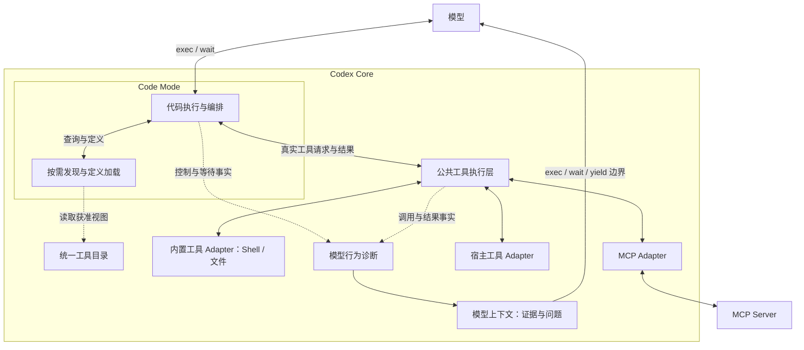

# 公共工具执行与模型行为诊断

架构决定由 [ADR-0040](../decisions/0040-code-mode-shared-tool-runtime.md) 固定。本文记录实施工作包和行为验收。

嵌入的 Codex Core 是唯一工具执行权威。Core 管理 Code Mode 运行时、工具目录、公共执行和运行事实。当前模型通过 Code Mode 使用所有工具，并根据诊断选择下一步。

## 公共 Interface

Code Mode 对模型提供 `exec`、`wait`。所有工具的按需发现、定义加载和组合调用封装在 Code Mode 内部。exec 控制代码执行，wait 等待已有执行。

Core 维护统一工具目录。Code Mode 按需读取目录的获准视图，取得真实工具身份与输入输出 schema。目录视图是统一目录的读取 Interface。

| Module | Interface | 职责 |
| --- | --- | --- |
| Code Mode | exec、wait | 按需发现、定义加载、代码执行、组合调用及外层结果交付 |
| 公共工具执行 | 真实工具调用 | 统一授权、hook、执行策略、调用事实、结果处置、取消和恢复 |
| 工具 Adapter | 定义提供与工具执行 | 接入内置工具、MCP 和宿主工具，实现协议与业务语义，声明输入依赖、账号会话、结果有效性和副作用恢复规则 |
| 模型行为诊断 | 运行事实输入与诊断输出 | 判断疑似循环、等待异常和执行爆炸，提供证据与问题 |

宿主将认可的工具定义和策略注册到统一目录。公共执行层封装操作识别、调用关联、事实记录、结果复用和反馈规则。新工具通过 Adapter 接入。

## 架构与调用流程

模型提交代码或等待请求。Code Mode 执行代码，按需查询工具定义，再发起真实工具调用。

所有真实工具调用从 Code Mode 进入 Core 公共执行层。公共层按真实工具身份处理授权和策略，再经对应 Adapter 执行。工具包括 Shell、文件、MCP 和宿主工具。结果沿原路径返回。Code Mode 汇总输出后交给模型。

外层 exec/wait 管理代码运行与等待。内部真实调用形成工具执行事实。Core 保存两者的父子关联，并维护等待与恢复记录。

代码对文件、进程、网络和宿主能力的访问，通过 Core 提供的受控工具 Interface 执行。Code Mode 承接发现和编排；Core 公共层按实际工具身份分别授权、记录、处置和恢复。



## 调用与执行事实

Core 分别记录外层 exec/wait、Code Mode 目录查询和内部真实工具调用。各类事实保留运行、父调用和等待关联。

公共执行层分别保存逻辑请求身份、语义操作标识和实际尝试身份。它先记录真实工具请求，再处理 hook 和有效输入。执行授权绑定实际输入。执行结果关联原逻辑请求和实际尝试。

每个新逻辑请求形成一次观测。观测覆盖实际执行、结果复用、合并等待、拒绝和失败。精确传输回放按逻辑身份恢复同一次观测。

结果复用与并发合并分别取得可信策略许可。Core 根据输入依赖与当前上下文判断结果有效性。输入变化时，Core 依据工具策略重新执行。

执行事实保存在 Core 运行时存储中，包含可信输入版本、处理结果、原实际尝试及父子调用和等待关联。结果明确绑定被验证的输入版本与来源上下文。临时句柄的可用性由对应 Adapter 核对。

执行状态与结果接受、交付处置分别保存。Core 恢复原执行事实与交付处置，并按当前读取权限交付结果。副作用结果未知时，先通过原业务幂等身份或下游回执核对，再决定后续操作。

## 模型行为诊断

诊断消费新逻辑请求与处理事实。缓存命中和合并等待同样提供模型行为观测。Core 自动重试与模型重新提出操作分别标明来源。

| 疑似模式 | 判断证据 |
| --- | --- |
| 循环停滞 | 相同语义操作或 A/B 操作反复出现，持续回到已有结果 |
| 等待死锁 | 可信等待关系成环，或等待对象已失效且缺少可推进该等待的执行方 |
| 执行爆炸 | 新分支或重试持续展开已有操作和失败路径，缺少对应的任务推进证据 |

可信任务推进证据更新进展窗口。证据包括新的可用信息、完成已声明的工作和解除阻塞。输入版本用于判断执行有效性，任务推进证据用于判断模型行为。

诊断分别表达正常等待、独立并行工作和进展未知。触发条件由可信策略定义。诊断附带关联调用、执行轨迹、等待关系、最近进展和待确认问题。

当前模型判断是否属于合理等待，或是否需要调整输入、合并分支、改变方法。模型随后选择下一步，并继续推进运行。

## 诊断反馈

Core 将诊断写入当前模型的运行上下文。工具结果保留执行与交付事实，诊断提供证据和问题。

Code Mode 的诊断随外层 `exec`、`wait` 或正常 `yield` 送达当前模型。每份诊断保留内部调用的父子关联，帮助模型定位具体操作。

同一诊断使用稳定身份和证据版本。Core 对重复投递去重，并按可信反馈规则更新提示。模型解释与后续执行事实分别记录。

## 行为验收

1. 所有任务默认产生调用观测。模型通过 Code Mode 使用所有工具；按需发现与定义加载属于 Code Mode 内部能力；真实工具调用经过 Core 公共执行层。
2. 新逻辑请求各自形成观测；精确传输回放恢复原观测；缓存命中可参与诊断。
3. 结果复用与并发合并分别按可信策略生效，结果可追溯到原实际尝试及输入版本。
4. hook、取消和恢复使用关联的 Core 运行时记录；未知副作用依据原业务身份核对。
5. 循环停滞、可信等待异常和重复执行分支产生带证据的问题；正常等待与独立并行工作具有准确表达。
6. 输入变化允许按策略重新验证；任务推进证据更新诊断窗口。
7. 任意工具的诊断经 Core 模型上下文和 Code Mode 外层 exec/wait/yield 到达当前模型；模型选择下一步；稳定诊断身份支持反馈去重。
8. 代码对文件、进程、网络和宿主能力的访问均进入 Core 工具 Interface，按真实工具身份执行授权和记录。

## 实施计划

按六个工作包推进。每包形成一份可独立验收的变更。P1 建立真实 Kernel 与 Code Mode 链路，后续工作包在该链路上扩展。P4 先验证诊断反馈，P5 再验证复用与等待场景中的诊断行为，P6 收口整体产品。

上游路径相对 `third_party/codex/codex-rs/`。表述中的新增 Module 均放在 Core 所属目录。产品 Adapter 提供策略，Worker、Control Plane 和 UI 消费 Core 事实的投影。


### P1：原生运行时与最小真实链路

**依赖：**无。

**改动位置：**`crates/kernel/src/lib.rs`、上游 `core-api/src/lib.rs`、`core/src/tools/code_mode/`、`code-mode/src/remote_session.rs`、`code-mode-host/`、`code-mode-runtime/`、`code-mode-protocol/`；构建位置为 `scripts/build-community.mjs`、`scripts/release-artifact-contract.mjs` 和 `package.json`。

1. 将产品构建的 Code Mode host 绑定到 Kernel 初始化。固定 host 路径、版本、协议和产物身份。
2. 接通 exec 创建 cell、wait 等待 cell、正常 yield 返回输出的链路。Core 管理运行时生命周期。
3. 在 Code Mode 内提供目录查询与定义加载，先接入 Shell 和一个本地 MCP fixture。两种真实调用均经过 Core 工具执行 Interface。
4. 固定可导入模块与工具回调。代码的文件、进程、网络和宿主操作通过 Core 工具 Interface 执行。
5. 将 Rust/V8/ICU host、运行资源和测试构建加入产品产物合同。验证四个发布目标的构建方式与运行条件。

**退出验收：**`tests/` 的确定性模型流使用真实 Kernel 和产品构建的 host，完成发现、调用、返回结果及 wait。长任务正常 yield 后保留活跃 cell。用户取消关闭对应运行。四目标 host 构建、产物身份和最小运行检查通过。

### P2：统一目录、所有工具与 Provider 接入

**依赖：**P1。

**改动位置：**上游 `core/src/tools/{spec_plan.rs,registry.rs,router.rs,parallel.rs,context.rs}`、`tools/src/code_mode.rs`；`crates/winwincode-codex/src/action_bridge.rs`；`crates/winwincode-provider/src/{device_extensions.rs,provider_openai.rs,provider_anthropic.rs}`；`crates/winwincode-execution-port/src/`。

1. 由同一工具注册目录提供真实身份、定义和宿主认可的策略。Code Mode 查询其获准视图，按需加载定义。
2. 模型工具面固定为 exec/wait。内置工具、MCP 和宿主工具全部注册为 Code Mode 内部可调用能力。每项获准能力都具备 Core 可分派执行端。
3. 按真实工具身份执行授权与 hook。exec/wait 的控制授权和内部工具的操作授权分别处理。hook 后的实际输入绑定执行授权。
4. 建立完整覆盖矩阵：function、freeform、namespace；标识规范化冲突；不同 MCP 服务的同名工具；用户问答与权限等待；长进程、轮询与取消；图片、音频与文件引用。
5. 核对动态目录、schema、账号和会话变化。定义版本与运行作用域进入请求记录。Provider 转换保持外层调用身份、内容块和恢复历史一致。

**退出验收：**目录中每项获准能力都通过真实链路调用。OpenAI 与 Anthropic 路线的模型请求只暴露 exec/wait。覆盖矩阵逐项通过；问答和权限请求能等待外部输入后继续执行；名称冲突返回明确配置错误；媒体结果及长任务语义完整。

### P3：执行事实、结果处置与恢复

**依赖：**P2。

**改动位置：**上游 `core/src/tools/{registry.rs,parallel.rs,context.rs}`、`core/src/tools/code_mode/`、`state/`、`code-mode-protocol/`；`crates/winwincode-codex/src/{action_bridge.rs,workrun_runtime_projection.rs}`；执行端口和 `packages/contracts/src/runtime-events.ts`。

1. 在 Core 运行时存储中持久化逻辑请求、语义操作、实际尝试和结果。固定 run、turn、cell、父调用与等待关联。
2. 逻辑请求身份保持稳定。语义操作标识及执行授权绑定 hook 后的实际输入。真实派发前认领实际尝试，并提交可恢复记录。
3. 新逻辑请求先形成观测，处理事实覆盖执行、复用、合并等待、拒绝和失败。精确传输回放恢复同一次观测。
4. 分别保存执行状态和输出的接受、拒绝、交付处置。记录结构化值、内容引用、输入版本及原实际尝试，恢复时按当前读取权限交付。
5. 原副作用结果未知时，通过原业务幂等身份或下游回执核对。cell 活跃状态与历史输出分别核对。cell 失效返回明确恢复状态，由模型依据事实选择后续操作。
6. 执行回执与可复用结果分别保留和清理。回执保留期覆盖任务恢复期限。Worker、Control Plane 和 UI 通过版本化事件取得投影。

**退出验收：**注入派发前、业务副作用后、结果提交后、hook 拒绝后及响应交付中的崩溃。恢复保持原操作与结果处置一致。精确回放和新逻辑请求具有正确观测数量。失效 cell、未知副作用及权限变化均返回准确状态；Core 事实能重建投影。

### P4：模型行为诊断与反馈

**依赖：**P3。

**改动位置：**上游 `core/src/tools/` 内新增诊断 Module，接入 `registry.rs`、`parallel.rs`、Code Mode 的 `mod.rs`、`delegate.rs`、`response_adapter.rs` 和 Core 模型上下文；产品运行入口为 `crates/kernel/src/lib.rs`；模型上下文由上游 `core/src/context/` 定义。

1. 所有任务初始化时装载 Core 诊断策略。根据逻辑请求、处理结果、父子关系及可信等待关系，识别循环停滞、等待异常和重复分支扩张。
2. 诊断输出稳定身份、证据版本、关联调用、最近可信进展和待判断问题。正常等待、独立并行工作及进展未知分别表达。
3. 模型解释作为响应记录保存。进展窗口由 Core 可核对的新信息、任务产出或阻塞解除证据更新。
4. 建立可恢复的诊断反馈队列。证据更新按稳定身份去重。反馈进入当前模型上下文，并随外层 exec/wait 或正常 yield 交付。
5. 将反馈队列与正常 yield 调度连接。诊断交付后 cell 保持活跃，运行状态保持其实际含义。模型收到证据和问题后选择下一步。

**退出验收：**真实链路中的相同操作、A/B 往返、失效等待对象及重复分支产生可追溯诊断。内部 catch 和持续工具循环下，反馈在下一次正常 yield 进入模型可见内容。模型能解释合理等待或调整方法。诊断交付、去重和恢复保持调用与 cell 状态准确。

### P5：可信依赖、结果复用与并发合并

**依赖：**P4。可信依赖与推进事件通过同一事实 Interface 提供，并在实际诊断链路中验收。

**改动位置：**上游 `core/src/tools/{registry.rs,parallel.rs,context.rs}`、Core 事实存储和工具策略 Interface；`crates/winwincode-codex/src/tool_input_source.rs` 作为产品依赖 Adapter 接入位置；`tests/` 增加 `public_smoke` 场景。

1. Adapter 提供可信输入依赖、账号与会话作用域，以及结果有效性、复用、合并和副作用核对规则。宿主冻结认可的策略版本。
2. 请求绑定执行所验证的输入快照。依赖在执行期间变化时核对结果来源；结果的复用资格由可验证的版本与来源事实确定。
3. 结果复用与并发合并分别取得可信许可。复用前核对当前授权、实际输入、依赖、账号、会话及临时句柄寿命。
4. 同一实际尝试可服务多个独立逻辑请求。每个等待者保留自己的回执与取消状态。外层代码运行和内部工具执行使用合适的执行许可。
5. 为 `public_smoke` 接入可信输入快照与结果验证。输入变化触发重新验证；相同输入依策略复用。源文件 A/B 往返按可信任务推进证据判断停滞。

**退出验收：**覆盖输入变化、执行中变化、账号切换、权限变化、会话失效及未知副作用。缓存命中和合并等待各自形成观测。单个等待者取消后，其余等待者继续取得正确结果。首次执行、获准复用、变更后重新验证和 A/B 往返均通过真实链路验收。

### P6：产品交互、构建与发布验收

**依赖：**P5。

**改动位置：**`crates/winwincode-codex/src/workrun_runtime_projection.rs`、执行端口、`packages/contracts/src/runtime-events.ts`、`apps/client/`、`packages/strongflow/`；`scripts/{build-community.mjs,release-artifact-contract.mjs,stage-community-core-worker-runtime.mjs}`；`upstream/{sources.lock.json,patches/codex/}`。

1. DSH 和 StrongFlow 消费同一 Core 投影，展示代码运行、真实工具名称、父子调用、权限与问答等待、取消、恢复及诊断。
2. 固定产品的 Code Mode 模式与诊断默认值。任务保存目录、策略和运行时版本；恢复核对这些版本与当前能力。
3. 发布产物包含匹配的 Kernel、Code Mode host 和运行资源。启动核对可信路径、版本、协议及完整性，能力缺失返回明确启动错误。
4. 收口上游补丁、来源锁定、准确依赖版本、文件 allowlist、第三方许可与 notice。更新分发和验证合同。
5. 在四个发布目标执行安装和真实运行验收。各工作包先运行相关检查；最终通过仓库全量验证及产物检查。

**退出验收：**DSH 和 StrongFlow 都完成发现、工具调用、问答、权限等待、长任务、诊断及恢复场景。四目标产物运行通过，上游补丁可重放，发布契约与产物一致。

```bash
corepack pnpm typecheck
corepack pnpm test
corepack pnpm lint
corepack pnpm build
corepack pnpm verify
```

### 每包交付物与实施风险

每包提交实现、对应行为测试、上游补丁记录和验收证据。P1 首先确定 V8/ICU 的四目标构建与产品运行条件。P2 收口全部工具类型和外部交互。P3 的崩溃注入确定副作用与输出处置的恢复保证。P4 确定反馈到达模型的正常 yield 时机。P5 用真实输入变化验证复用许可。P6 在安装产物上验证整体行为。

这六项是实施退出条件。任务进度和依赖保存在 Beads。
