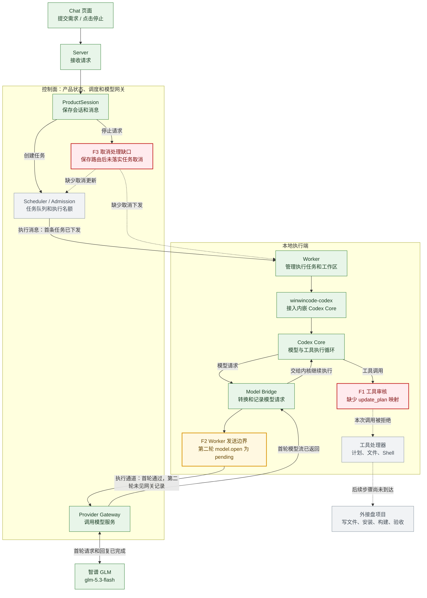
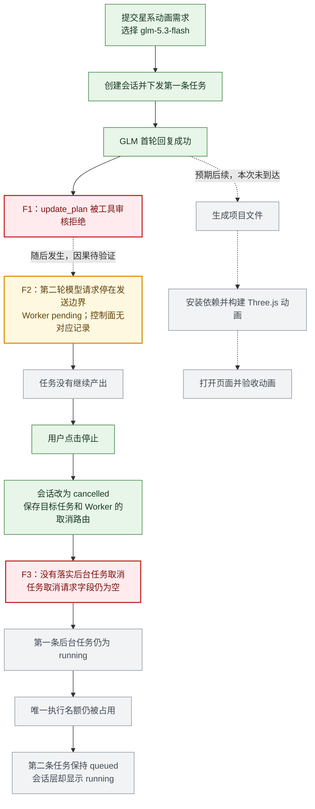

# 当前结果：MiMo 已完成生成、构建和 Chat 项目下载

2026-09-14，真实会话 `psn_PWEP6SBJNTJAXXAQGV6KXEEGFH`、任务 `job_71412F9AC83259938E04A6011E` 使用 `mimo-v2.5-pro`，在 WinWinCode 内完成 Three.js 星系动画的源码生成、`npm install` 和 `npm run build`。任务正常完成，Chat 显示“下载项目文件”。通过该按钮取得 ZIP，解压至外接盘 `/Volumes/ORICO/threejs-galaxy-mimo`；再次安装和构建通过，浏览器检查确认动画持续变化、拖动缩放与 1440 / 390 宽度正常，无脚本错误。

[打开动画预览](http://127.0.0.1:18084/) · [打开真实对话](https://127.0.0.1:18082/#/chat?session=psn_PWEP6SBJNTJAXXAQGV6KXEEGFH) · [HTML 架构与流程图](threejs-execution-diagnosis.html)

模型调用归 **Device 的 Worker / Provider 组件**，内嵌 Codex Core 负责执行循环。Web 继续提供 Provider 设置和测试入口；浏览器加密配置，Server 转发密文与公开回执，Device 私有数据库保存密钥并发出 HTTPS 请求。MiMo 实际端点是 `https://token-plan-cn.xiaomimimo.com/anthropic/v1/messages`。Server 与 Device 主进程未继承 MiMo 密钥环境变量，执行 Worker 从设备私有存储读取配置。

**GLM 已恢复并实测通过**：在 Web 设置中对设备保存的 `zhipu-glm` 点击“测试连接”，收到设备成功调用模型的回执。型号为 `glm-5.3-flash`，端点为 `https://open.bigmodel.cn/api/anthropic/v1/messages`；本次未调用标准版 `glm-5.3`。此前 1308 是历史失败记录，不代表当前仍被限额。

## 故障位置与当前状态

| 标记 | 原因 | 修复与实际证据 |
| --- | --- | --- |
| F1 | 工具审核缺少 `update_plan`；Chat 又误走仅支持 WorkRun 的身份查询。 | 补齐映射，按执行范围读取持久身份。GLM 与 MiMo 的计划工具、MiMo Shell 均已执行。`HOST_ACTION_REJECTED` 是宿主审核的统一拒绝码，具体原因须结合授权回执判断。 |
| F2 | 模型请求原由 Server 管理，多轮绑定和不同 Worker 的相同消息编号产生冲突。 | Provider 迁至 Device；同一执行保留多轮模型身份，回执绑定任务与执行身份。MiMo 连续调用完成源码和构建；Web 保存与设备测试保留。 |
| F3 | 会话取消没有继续写入执行队列。 | 取消按 Worker 身份投递；真实测试已释放旧设备占用并启动新任务。本次动画任务正常 `completed`，完成后的测试占用也已释放。 |
| F4 | Chat 声明可写，但 Core 未收到该权限。 | 复用工作目录权限设置；MiMo 在隔离 checkout 写出源码与 lockfile。 |
| F5 | ureq 在读正文时仍应用 60 秒响应头期限，误截断长回复。 | 移除该独立期限，保留连接、读取空闲与整次请求时限。慢流测试和真实 MiMo 生成通过。 |
| F6 | Chat 返回空产物列表后就清理 checkout，生成文件会丢失。 | 复用 Git 快照和 Artifact 上传队列；保存 ZIP 并收到持久 ACK 后才结束和清理。Chat 新增按对话、任务身份和摘要验证的下载入口。真实 ZIP 下载、独立构建和浏览器检查通过。 |
| F7 | Core 批准请求没有登记 Gate；执行版本取错；页面审批容器一直隐藏。 | 根据可信 Worker 请求登记审批，使用执行预留版本，正确显示审批容器。真实 `npm view three version` 申请在 Web 批准后返回 `0.186.0`，任务正常完成。动画任务的依赖安装直接成功，无需再申请。 |

## 文件与验收证据

本次 ZIP 含 7 个文件：`.gitignore`、README、页面入口、依赖配置、lockfile、JavaScript 和 CSS。包含 8 万星系粒子、发光中心球体、Bloom 后处理和 OrbitControls。项目下载不包含 `.git`、`node_modules` 或 `dist`；在新目录执行 `npm ci` 和 `npm run build` 可重建，开发启动命令为 `npm run dev`。

产物 ID：`art_DBDCB5DAF0DF324E0983EB003B`；大小 **11,967 字节**；SHA-256：`dca60de7ab1fda2c6a0edd1f9cffc5f66e19226ec09b2740403552e97c906fb8`。下载入口是 `session.artifact.get`，只读取当前对话已保存终态引用的产物，逐块限制为 256 KiB，服务端校验完整内容摘要。

运行证据保存在 `/Volumes/ORICO/winwincode-data/device-provider-live/`：

- `mimo-final-attempt.json`：真实会话地址；对应 rollout 记录实际型号、命令和构建结果。
- `mimo-download-first.json`、`mimo-project-first.zip`：Chat 下载记录与原始 ZIP。
- `mimo-download-restart.json`、`mimo-project-restart.zip`：正常释放并重启 Server / Device 后再次通过 Chat 下载，内容与首次逐字节一致。
- `mimo-project-extraction.json`：外接盘路径及解压文件摘要。
- `mimo-downloaded-build.log`、`mimo-downloaded-animation-browser-proof.json`：下载项目的独立构建和浏览器检查。
- `glm-restored-test.json`：GLM 恢复后的设备连接测试。
- `mimo-approval-attempt.json`、`approval-decided.txt`：联网申请与 Web 批准证据。

本轮相关检查包括：Rust 81 项（执行入口、会话服务、Gate、Worker 生命周期、产物队列和阶段产物），Chat 前端 40 项，Clippy 与格式检查。API 与产物契约 39 项通过；还修正了一处旧 Git 验证脚本引用已改名测试、导致实际运行 0 项的缺口。

## 已知边界

Chat 成功与失败时保存已修改文件；取消时先在设备留下 Git 恢复引用。下载产物独立保存，用户原项目的现有修改不会被覆盖。本次是空项目生成流程，不等于已提供对任意现有项目的自动合并。

默认执行授权为 15 分钟，尚无协议自动续租；本次隔离实测预设为 60 分钟。Provider 单次请求总时限仍为 5 分钟。旧对话恢复 `winwincode-pfls`、取消中途退出的补偿 `winwincode-y2es`、生产 API 验收脚本迁移 `winwincode-00os` 仍单独跟踪；未宣称整个 `pnpm verify` 通过。Provider 迁移阶段曾通过全量 TypeScript 634 项、Rust 2,285 项（9 项手动测试未运行），这些是此前检查记录。

Archify 在早期扩展列表中是演示条目；当前源码没有可调用的绘图实现。HTML 使用原生 SVG，标出当前组件归属与修复状态。以下保留首次故障的历史快照，其中“未生成”“未修改”均指当时状态。

---

# GLM 5.3 Flash 创建 Three.js 项目的故障分析

本次执行停在 WinWinCode 的工具审核和模型续接环节；点击停止后，取消操作又没有落实到后台任务，导致后续任务继续排队。动画文件尚未生成。

分析对象是 2026-09-14 的本地 Chat 实测：模型 `glm-5.3-flash`，项目 `/Volumes/ORICO/threejs-galaxy`，页面 `http://127.0.0.1:18081`。只有第一条任务实际取得模型回复；第二条任务仍在队列中。以下结论不扩大到其他模型或所有部署方式。

## 故障位置

| 标记 | 环节 | 已确认事实与影响 | 原因确认程度 |
| --- | --- | --- | --- |
| F1 | Codex Core → 工具审核 → 内置计划工具 | 首个 `update_plan` 调用被 `HOST_ACTION_REJECTED` 拒绝，执行计划没有更新。审核映射缺少这个内置工具。 | 已确认代码缺项。运行日志把审核错误统一成一个错误码，不能仅靠该错误码排除更早的身份检查失败。 |
| F2 | Worker 的模型发送记录 → 执行通道 → 控制面模型网关 | 第二轮 `model.open` 已保存为 `pending`；控制面没有对应的模型调用记录，因此没有证据证明第二轮已发给 GLM。 | 停滞范围已定位；首次未能发送的具体原因待验证。 |
| F3 | 会话取消 → 后台任务取消 | 会话已经是 `cancelled`，目标任务和 Worker 的取消路由也已保存；后台任务仍是 `running`，取消请求字段为空。唯一执行名额没有释放，第二条任务保持 `queued`。 | 已确认当前 API 处理链只取取消回执中的会话结果，没有继续执行取消路由。 |

首轮模型请求和回复正常经过真实 GLM 服务。外接盘项目已经初始化，当前只有 `.git`；文件生成、依赖安装、Three.js 构建和浏览器验收均未到达，不能据此判断这些后续环节是否正常。

## 标注后的架构图

只展开本次本地 Chat 执行相关组件；本地组装层将控制面和 Worker 放在同一进程内，二者仍通过执行消息交互。绿色表示本次已走通，红色表示已确认缺陷，黄色表示停滞范围已定位但原因待验证，灰色表示尚未到达。虚线含义以边上的文字为准。

## 标注后的实际流程图

F1 和 F2 是先后观察到的两个故障点，目前没有证据证明工具拒绝直接造成模型续接停滞。取消缺口与任务名额未释放，则同时得到会话、调度和配额记录支持。

## 代码证据与后续核验落点

### F1：内核提供的计划工具没有通过宿主审核的对应规则

- [`canonical_tool_requests`](../crates/winwincode-codex/src/action_bridge.rs#L1276) 将工具调用转成权限请求。它对 `request_user_input` 有内置控制工具规则，也识别文件和 Shell 操作，但没有 `update_plan`，因此这类普通函数调用会落入 `UnknownCapability`。
- [`CoreToolCallGate::authorize`](../crates/kernel/src/lib.rs#L305) 将宿主审核的所有错误统一转换为 `HOST_ACTION_REJECTED`。实际执行记录中出现了这个错误。
- 后续修复应对齐内核提供的工具和审核层认识的工具；需要核验普通计划调用能到达计划处理器，同时未知能力仍被拒绝。

### F2：第二轮请求已保存，尚未确认完成发送

- [`ModelBridge::prepare_open_stream`](../crates/winwincode-codex/src/model_bridge.rs#L1160) 在真正发送前登记模型调用。因此账本有第二轮，不能等同于 GLM 收到了第二次请求。
- 本次进一步查到 Worker `execution_outbox` 的第 918 条记录：第二轮 `model.open` 已存在，状态为 `pending`。控制面 `internal_provider_exchanges` 只有首轮，且首轮状态为 `terminal`。
- [`take_execution_messages`](../crates/winwincode-codex/src/adapter.rs#L4093) 保存发送消息；[`flush_codex_execution_messages`](../crates/winwincode-worker/src/lib.rs#L3590) 负责转发；[`send_retained_delivery`](../crates/winwincode-worker/src/lib.rs#L3473) 在执行通道返回成功后才标记发送状态。
- [`flush_durable_execution_deliveries_with_core_replay`](../crates/winwincode-worker/src/lib.rs#L3503) 的通用重发循环明确跳过 `ModelOpenMessage`，模型恢复需要配合内核重放。这解释了为什么不能假定“重启就会把所有 pending 消息重新发出”，但不足以证明首次停滞由这一分支造成。
- 下一次诊断只需沿第二轮消息核对“取出消息 → 调用执行通道 → 控制面接收 → 网关登记”的进入、返回和错误；目前不能写成 GLM 超时、锁死或模型配额不足。

### F3：取消结果返回给页面，执行取消没有继续落实

- [`cancel_session`](../crates/winwincode-control-plane/src/product_session_chat.rs#L963) 计算并保存取消路由，更新会话、消息与待执行意图，返回带路由的回执。
- [`ProductSessionApiService::cancel`](../crates/winwincode-control-plane/src/product_session_api.rs#L155) 只取 `receipt.mutation.record.projection()` 返回 API；[`session_command`](../crates/winwincode-server/src/application.rs#L388) 直接调用它。当前处理链没有消费回执中的取消路由。
- 实际保存的取消路由包含任务、租约和 Worker 身份；但调度表 `cancellation_request_id` 为空，任务仍是 `running`。控制面待发给 Worker 的消息表及发送结算表均为空。
- [`任务结果处理`](../crates/winwincode-control-plane/src/product_session_execution_application.rs#L1210) 已有收到取消或失败结果后释放名额的逻辑。本次未进入这条结束路径。后续应补全取消请求、Worker 中断和任务结束之间的处理，并核验名额释放及重启恢复。

## 实测证据

只读快照时间：**2026-09-14 13:25:49，Asia/Shanghai**。服务器此前经历过两次正常重启，因此当前发送记录也包含恢复后的状态；本分析不把快照当成第一次停滞瞬间的内存状态。

| 对象 | 身份或位置 | 结果 |
| --- | --- | --- |
| 第一条会话 | `psn_TACBZ5G50W5DG4G645Q6DK4F86` | 会话 `cancelled` |
| 第一条任务 | `job_C77A7FBA4753F719E46C8C946C` | 任务、名额记录仍 `running` |
| 第二条会话 | `psn_8VAWYK8F4CR6DQHRSK4SXSC732` | 会话 `running` |
| 第二条任务 | `job_F0BE51EAA143C718EFCB176621` | 任务、名额记录均 `queued`，没有开始时间 |
| 首轮模型交换 | `mdl_134749C75F851DFE5DA3A5FDA7` | 模型完成；控制面状态 `terminal` |
| 第二轮模型交换 | `mdl_69DF702C77B2105E7FA6F331A9` | Worker 发送记录 `pending`；控制面没有对应记录 |
| 外接盘项目 | `/Volumes/ORICO/threejs-galaxy` | 只有 `.git`，尚无动画文件 |

证据文件位于本机运行数据目录 `/Volumes/ORICO/winwincode-data/threejs-galaxy`：

- `diagnosis-evidence.json`：本次只读查询生成的状态快照，不包含凭据或模型请求正文。
- `attempt-result.json`：首次操作结果。
- `server/control-plane.sqlite3`：会话、调度、名额、模型网关记录。
- `server/worker-runtime/worker-codex.sqlite3`：模型调用账本、模型帧、待发送记录。
- `server/worker-runtime/kernel-home/sessions/2026/09/14/rollout-2026-09-14T13-01-39-01a09e4a-d6b1-7990-8cb0-5e1241eb2e64.jsonl`：真实模型名、回复和工具拒绝记录。

核对源码时的 HEAD 为 `85169bab4416e3e17e85ffffb1dd8d03989ce1d5`。运行二进制摘要与其构建记录一致；构建记录注明的 Git HEAD 是 `7c1125a9ee1e06aa1fd9e48691442d91741aba15`，并带有构建时工作区差异摘要。两次提交间已比较的工具审核、模型桥、模型客户端、会话取消 API/服务、Server runtime 和本地组装文件无差异；未据此声称运行二进制与整个当前工作区完全一致。

本次只完成诊断与图示，没有修改执行代码或直接编辑运行数据库。Three.js 项目验收仍未通过，任务 `winwincode-ll8n` 保持进行中。后续先补全取消，使旧任务能正确结束；再核验计划工具和模型续接，最后继续原始动画任务。
